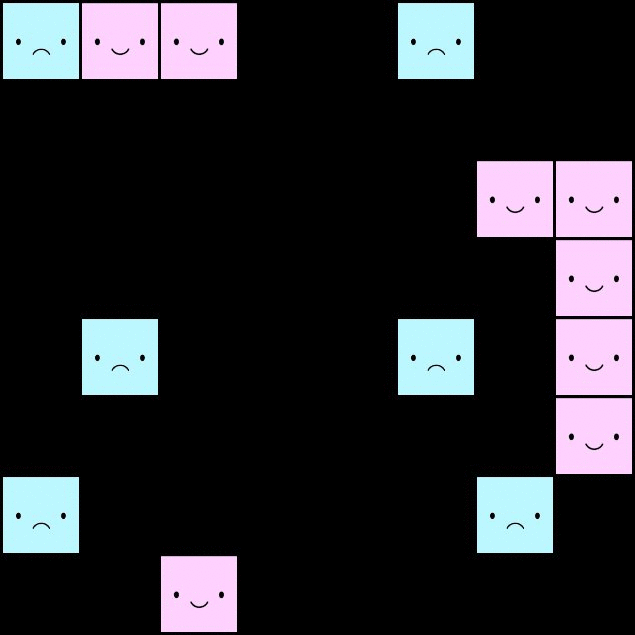
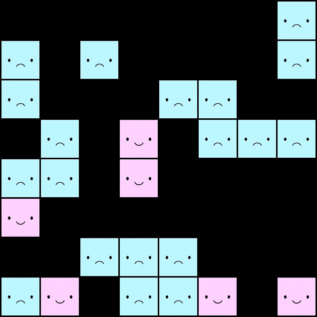
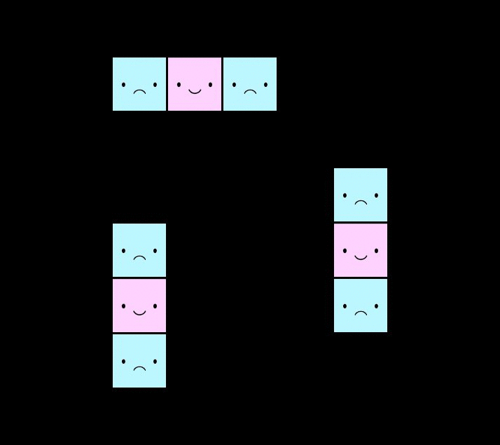
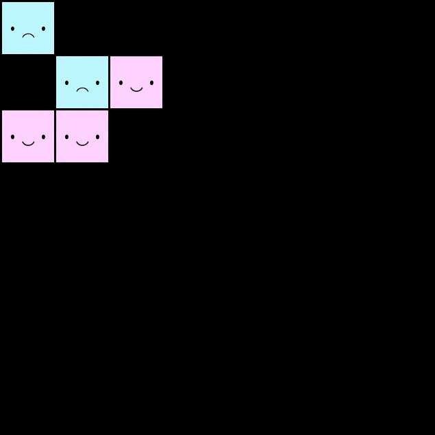
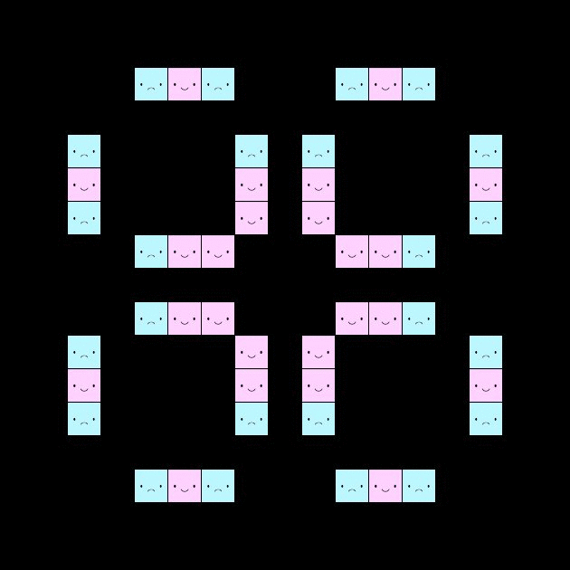
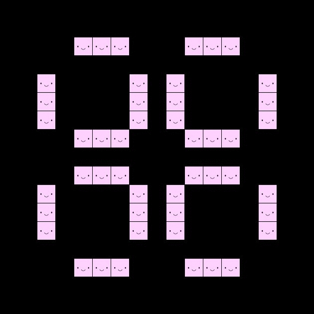

# PCBS_CellularAutomata

## Prior programming skills 

During my bachelor degree in mathematics, I took a few basic programming courses : programming in C++, introduction to object-oriented programming in Java and introduction to Python.

## Introduction

A cellular automaton is a discrete dynamical system that models behaviours based on a certain set of rules. It is represented by a collection of cells in an infinite grid that evolve through time, depending on the states of their neighbours.
The goal of this project is to implement John Conway's \"Game of Life" in python (using the PyGame library). Here, the grid will be a torus : https://en.wikipedia.org/wiki/Torus (essentially a compact space with no bordure). This allows to observe interesting behaviour we could not observe on a bounded grid.

The rules for Conway's game of life are the following :  
1. Live cells with 2 or 3 live neighbours are happy and make it to the next round.  
2. Live cells with 1 or fewer live neighbours are sad and die from isolation.  
3. Live cells with 4 or more live neighbours are sad and die from overcrowding.  
4. Empty cells with exactly 3 live neighbours give rise to a newborn cell.  

In this program, the default rules are Conway's rules. We can however define a new set of rules and observe how differently the automata behaves.

Each cell is represented by a coloured square with a facial expression.  
<ul style="list-style-type:circle" >
<li style="padding-left:4em"> A cell is happy when it is surrounded by the ideal number of neighbours. It will make ot to the next round. </li>
<li style="padding-left:4em"> A cell is sad when it is isolated or overcrowded. It will be dead by the next round. </li>
<li style="padding-left:4em"> Light pink and light blue cells represent newborn cells. </li>
</ul>


## Setup

This program requires Python 3 and a few python packages which can be installed by using pip in the command line : 
```console
foo@bar:~$ pip3 install pygame pypi argparse os-sys 
```
## The Program

### How to run it

The program can be executed via command line :
```console
foo@bar:~$ python main.py [-h] [-s int int] [-p float] [-f path] [-r int int int]
```

The optional arguments are the following :
<ul style="list-style-type:none"> <li>-h, --help : a brief message about the program and detailed descriptions for each of the optional arguments </li>
<li> -s, --size : specify size of the random starting grid (by default : 16 x 16) </li>
<li> -p, --proportion : specify the proportion of cells on the random starting grid (by default : 0.33) </li>
<li> -f --file : use a pre-defined starting grid stored in text file (by default : randomly generated) </li>
<li> -r, --rules : specify the rules of the game of life (by default : 2 3 3) </li>
</ul>

You will find a more detailed description for each of the optional arguments via the terminal :
```console
foo@bar:~$ python main.py --help
```
Once the program is executed, press the space bar to begin or pause the animation.

A folder named "screen_capture" will have been created once the program has run. The forder contains screen captures of the automaton at each state and a text file with details about which arguments were used when executing the program.
<br>

### A few examples

#### Randomly generated grids
  
Initial grid was a randomly generated 8 x 8 grid, with a proportion of 0.2 live cells :
```console
foo@bar:~$ python main.py -s 8 8 -p 0.2
```
<p align="center"></p>  


Initial grid was a randomly generated 8 x 8 grid, with a different set of rules (a cell dies if it has strictly less than 1 neighbour or strictly more than 2 neighbours, and a new cell is born if there are exactly 3 neighbours).
```console
foo@bar:~$ python main.py -s 8 8 -r 1 2 3
```
<p align="center"></p>

#### An example of blinkers
  
Initial grid was given by demo_blinker.txt :
```console
foo@bar:~$ python main.py -f grids/demo_examples/demo_blinker.txt
```
<p align="center"></p>

#### An example of a glider
  
Initial grid was given by demo_glider.txt :
```console
foo@bar:~$ python main.py -f grids/demo_examples/demo_glider.txt
```
<p align="center"></p>

#### An example of how changing the rules changes the outcome
Initial grid was given by pulsar.txt, with default rules (a cell dies if it has strictly less than 2 neighbours or strictly more than 3 neighbours, and a new cell is born if there are exactly 3 neighbours) :
```console
foo@bar:~$ python main.py -f grids/oscillators/pulsar.txt
```
<p align="center"></p>
As you can see, this oscillator is periodic, of period 3.  

However, when you change the rules even slightly, the automaton behaves in a completely different way. 

Initial grid was given by pulsar.txt, with a different set of rules (a cell dies if it has strictly less than 1 neighbour or strictly more than 3 neighbours, and a new cell is born if there are exactly 3 neighbours) :
```console
foo@bar:~$ python main.py -f grids/oscillators/pulsar.txt -r 1 3 3 
```
<p align="center"></p>
As you can see, what was previously an oscillator is now still.

## What I learned 
This project was challenging at times and I feel like I have learned a lot from it. Here are a few examples of what I learned :

<ul style="list-style-type:circle" >
<li style="padding-left:4em"> What cellular automata are and what they can model
<li style="padding-left:4em"> How to implement classes in Python </li>
<li style="padding-left:4em"> The basics of PyGame and ArgParse </li>
<li style="padding-left:4em"> How to use Git </li>
<li style="padding-left:4em"> How to write a README.md file </li>
<li style="padding-left:4em"> How to write Docstrings </li>
</ul>

## Ideas to further improve the code
<ul style="list-style-type:circle">
<li style="padding-left:4em"> Check if program works on Windows </li>
<li style="padding-left:4em"> Create a function to determine the convergence states </li>
</ul>


## Other examples of cellular automata

Here are a few other examples of how cellular automata can be used :

<ul style="list-style-type:circle" >
<li style="padding-left:4em"> The Schelling segregation model : developed by Thomas Schelling, this automaton models a population where each individual has a small preference for being surrounded by kin and how this leads to group segregation. </li>
<li style="padding-left:4em"> The Nagel–Schreckenberg model : developed by Kai Nagel and Michael Schreckenberg, this automaton models traffic flow and how traffic jams emerge from interactions between cars. </li>
<li style="padding-left:4em"> Cellular Automata can also be used to model biological processes such as patterns in nature (for example seashell patterns) and complex cognitive behaviours (for example neural interactions, perception and learning). </li>
</ul>
