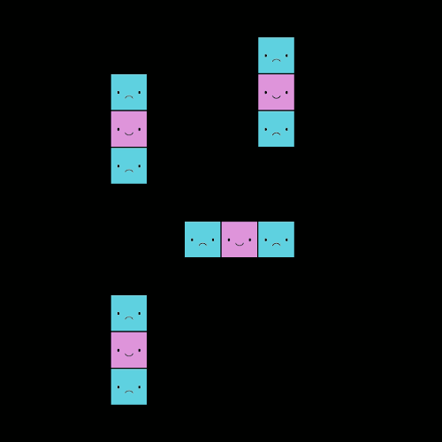
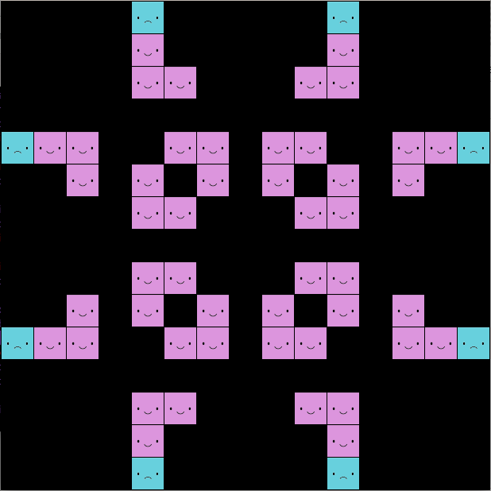
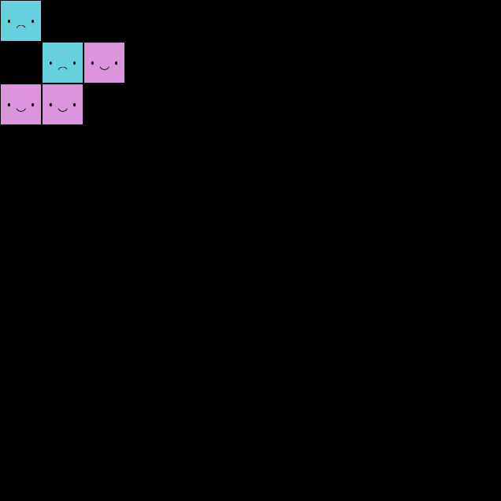

# PCBS_CellularAutomata

## Introduction

A cellular automaton is a discrete dynamical system that models behaviours based on a certain set of rules. It is represented by a collection of cells in an infinite grid that evolve through time, depending on the states of their neighbours.
The goal of this project is to implement John Conway's \"Game of Life" in python (using the PyGame library). Here, the grid will be finite, but we will still be able to observe the same patterns than we would on an infinite grid.

The rules for Conway's game of life are the following : 
1. Live cells with 2 or 3 live neighbours are happy and make it to the next round
2. Live cells with 1 or fewer live neighbours are sad and die from isolation
3. Live cells with 4 or more live neighbours are sad and die from overcrowding
4. Empty cells with exactly 3 neighbours give rise to a newborn cell

## Setup

This program requires Python 3 and a few python packages which can be installed by using pip in the command line : 
```console
foo@bar:~$ pip install pygame pypi argparse os-sys
```

## Usage

Executing with a predefined starting grid :
```console
foo@bar:~$ python main.py grids/file.txt
```

Executing with a random 12x12 grid :
```console
foo@bar:~$ python main.py 
```

Once program is executed, press the spacebar to begin or pause the animation. 

## The program
Below are a few examples of patterns that can be obtained with the program :
<div float="left">
	
	
	
</div>

(left : blinker, centre : pulsar, right : glider)

## Other examples of cellular automata

Here are a few other examples of how cellular automata can be used :

- the Schelling segregation model : developed by Thomas Schelling, this automaton models a population where each individual has a small preference for being surrounded by kin and how this leads to group segregation.
- the Nagel–Schreckenberg model : developed by Kai Nagel and Michael Schreckenberg, this automaton models traffic flow and how traffic jams emerge from interactions between cars.
- cellular automata can also be used to model biological processes such as patterns in nature (for example seashell patterns) and complex cognitive behaviours (for example neural interactions, perception and learning).
